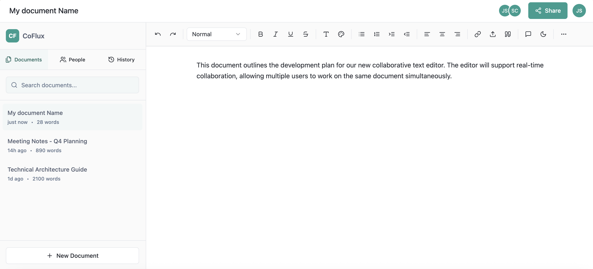
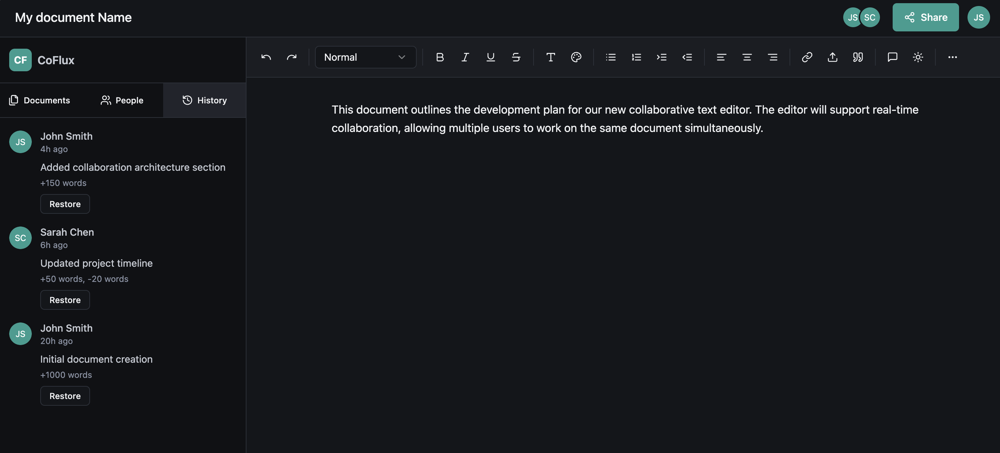

# Real-time Collaborative Editor

A full-stack, real-time collaborative editor with offline capabilities, built using React, Node.js, Express, and MongoDB. This editor allows multiple users to concurrently edit documents, features robust offline support, and includes a version control system for document management.

## Features

*   **Real-time Collaboration:** Powered by CRDTs (Yjs) and WebSockets for conflict-free, multi-user concurrent editing.
*   **Presence System:** See who else is currently viewing or editing the document.
*   **Offline-First Architecture:** Edit documents seamlessly even without an internet connection. Changes are synchronized with the server upon reconnection using IndexedDB for local persistence.
*   **Rich Text Editing:** Integrated with Lexical for a powerful and customizable rich text editing experience.
*   **User Authentication:** Secure user authentication using JSON Web Tokens (JWT).
*   **Version Control:**
    *   Document snapshots.
    *   Detailed change tracking.
    *   Ability to rollback to previous versions.

## Technologies Used

**Frontend:**

*   **React:** A JavaScript library for building user interfaces.
*   **Lexical:** An extensible rich text editor framework.
*   **Yjs:** A high-performance CRDT implementation for real-time collaboration.
*   **IndexedDB:** For client-side data storage and offline capabilities.
*   **WebSockets (via `websocket-ts` or similar):** For real-time communication.

**Backend:**

*   **Node.js:** A JavaScript runtime for server-side development.
*   **Express:** A fast, unopinionated, minimalist web framework for Node.js.
*   **MongoDB:** A NoSQL database for storing document data and user information.
*   **WebSockets (via `ws` or similar):** For real-time communication.
*   **Y-websocket:** WebSocket signaling for Yjs.
*   **JSON Web Tokens (JWT):** For secure user authentication.

## Architecture

The application follows a typical client-server architecture with several key components:

*   **Client-side (React):** Handles UI rendering, user interactions, rich text editing with Lexical, and offline data persistence with IndexedDB. It communicates with the server via WebSockets for real-time updates and REST APIs for authentication and initial data loading.
*   **Server-side (Node.js/Express):** Manages user authentication, document storage in MongoDB, and real-time synchronization via WebSockets using Yjs. It also handles version control logic.
*   **WebSockets:** Provide a persistent, bi-directional communication channel between clients and the server for real-time collaborative editing and presence updates.
*   **CRDTs (Yjs):** Ensure that concurrent edits from multiple users are merged without conflicts, maintaining data consistency.

## Screenshots

Here are some screenshots demonstrating the key features of the collaborative editor:

### Real-time Collaborative Editing
A view of multiple users editing a document simultaneously.



## Setup and Installation

### Prerequisites

*   Node.js (LTS version recommended)
*   MongoDB (running locally or a cloud instance)

### Backend Setup

1.  **Clone the repository:**
    ```bash
    git clone <repository-url>
    cd <repository-name>/server
    ```
2.  **Install dependencies:**
    ```bash
    npm install
    ```
3.  **Configure environment variables:**
    Create a `.env` file in the `server` directory and add the following:
    ```
    PORT=5000
    MONGO_URI=mongodb://localhost:27017/collaborative_editor
    JWT_SECRET=your_jwt_secret_key
    ```
    *Replace `your_jwt_secret_key` with a strong, random secret.*

4.  **Run the backend:**
    ```bash
    npm start
    ```
    The server will run on `http://localhost:5000` (or your specified PORT).

### Frontend Setup

1.  **Navigate to the client directory:**
    ```bash
    cd ../client
    ```
2.  **Install dependencies:**
    ```bash
    npm install
    ```
3.  **Configure environment variables:**
    Create a `.env` file in the `client` directory and add the following:
    ```
    REACT_APP_API_URL=http://localhost:5000/api
    REACT_APP_WS_URL=ws://localhost:5000
    ```

4.  **Run the frontend:**
    ```bash
    npm start
    ```
    The client application will open in your browser, typically at `http://localhost:3000`.

## Usage

1.  **Register/Login:** Create an account or log in to access the editor.
2.  **Create/Select Document:** Start a new document or open an existing one.
3.  **Collaborate:** Share the document URL with others to collaborate in real-time.
4.  **Offline Editing:** Disconnect from the internet and continue editing. Your changes will sync automatically when you reconnect.
5.  **Version History:** Access the document's version history to view past snapshots and rollback if needed.


